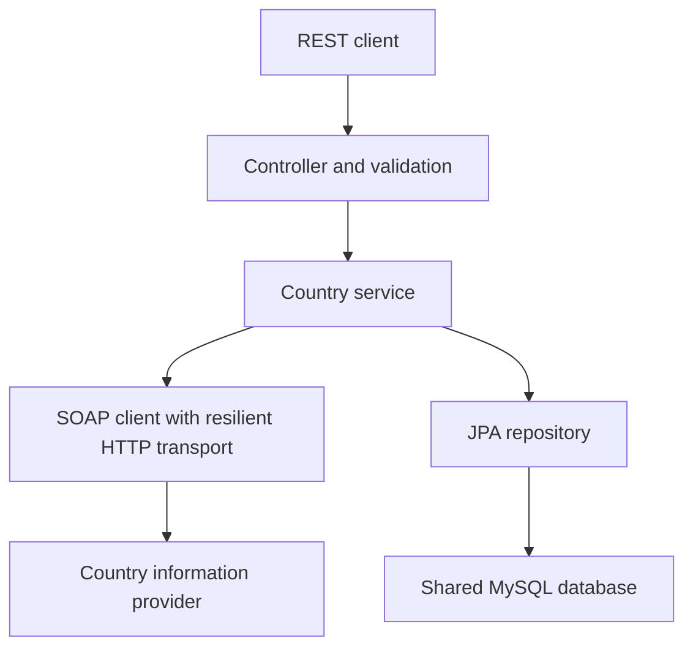

# Country Integration Service

Spring Boot REST service that retrieves country details from an external SOAP API and persists countries and their languages in MySQL. Built for the NCBA LOOP Integrations and Microservices Engineer case study.

## Architecture



Creation normalizes the country name to sentence case, resolves its ISO code with CountryISOCode, retrieves FullCountryInfo, checks for duplicates, and saves the country and languages. Stored-country reads, updates, and deletes use MySQL. External SOAP calls happen before the database save.

The application replicas share one database. Request state stays within each request. Retry and circuit breaker state is local to each application process.

## Technology

- Java 25, Spring Boot 4.1.1, and Maven wrapper.
- Spring Web, Bean Validation, Spring Data JPA, and MySQL 8.4.
- Java HttpClient and namespace-aware XML parsing for SOAP.
- Resilience4j retry and circuit breaker.
- Spring Boot Actuator, Micrometer, and structured ECS JSON logs.
- JUnit, Mockito, standalone MockMvc, and a local HTTP server for tests.
- Docker Compose and Kubernetes manifests.

## Quick start

Prerequisites: Java 25 and Docker Desktop. Run commands from the project root.

Copy the environment template:

```bash
cp .env.example .env
```

Edit `.env` and replace both password placeholders. Set DB_PASSWORD in your shell to the same application password:

```bash
export DB_PASSWORD='your_local_app_password'
docker compose up -d mysql
./mvnw clean package
docker compose up -d --build
```

The package step runs the full test suite. Its Spring Boot context test requires the development MySQL database on localhost:3307. If MySQL is still initializing, wait until it is healthy before packaging.

The Dockerfile copies the built JAR from target. After changing Java source, package the application again before rebuilding its image.

Check startup and test:

```bash
docker compose ps
docker compose logs --tail=40 app
curl -i http://localhost:8081/actuator/health
curl -i http://localhost:8081/api/countries
```

Allow Spring Boot to finish starting before sending requests. The application is exposed on localhost:8081. The development database is exposed on localhost:3307. Database files persist in the Compose mysql_data volume.

## REST API

| Method | Path | Expected success |
| --- | --- | --- |
| POST | /api/countries | 201 Created, response body and Location header |
| GET | /api/countries | 200 OK, country list |
| GET | /api/countries/{id} | 200 OK, country details |
| PUT | /api/countries/{id} | 200 OK, updated country |
| DELETE | /api/countries/{id} | 204 No Content |

Create a country:

```bash
curl -i --max-time 45 -X POST http://localhost:8081/api/countries \
  -H 'Content-Type: application/json' \
  -d '{"name":"kenya"}'
```

The first successful save returns country details, its generated ID, and languages. A repeated country ISO code returns 409. Use the returned ID for subsequent operations.

Example update body for PUT /api/countries/{id}:

```json
{
  "name": "Kenya",
  "capitalCity": "Nairobi",
  "phoneCode": "254",
  "continentCode": "AF",
  "currencyIsoCode": "KES",
  "countryFlag": "http://www.oorsprong.org/WebSamples.CountryInfo/Flags/Kenya.jpg",
  "languages": [
    {"isoCode": "swa", "name": "Swahili"},
    {"isoCode": "eng", "name": "English"}
  ]
}
```

Update replaces the language collection while preserving the country ID and ISO code. Country data returned by the provider is stored as received, with structural validation.

## Error handling and resilience

Errors use ProblemDetail responses with status, title, detail, instance, timestamp, and path. Validation failures include field errors.

| Status | Typical cause |
| --- | --- |
| 400 | Invalid fields, malformed JSON, or invalid parameter |
| 404 | Country or stored ID not found |
| 405 | HTTP method unsupported for the URL |
| 409 | Country ISO code already exists |
| 502 | Invalid SOAP result or unsuccessful upstream HTTP response |
| 503 | Transport connection failure or open circuit |
| 504 | Upstream timeout |

The transport uses a five-second connection timeout and an eight-second request timeout. Eligible failures receive at most two attempts with a 300-millisecond retry delay.

The circuit breaker evaluates logical calls after retry. It has a ten-call window, minimum five calls, 50% failure threshold, 30-second open duration, and two permitted half-open calls. It ignores non-retryable transport failures. SOAP faults and parsing errors occur outside the transport breaker.

During a SOAP outage, creation returns an explicit error and stored-country reads remain available through MySQL. This is the implemented degraded-operation behavior. Cached SOAP results and fabricated fallback data are not implemented.

XML parsing disables DOCTYPE declarations and external DTD/schema access. XML-special characters are escaped in requests.

## Observability

- X-Request-ID identifies each HTTP request and is included in request logging context.
- Structured request logs include method, path, response status, and elapsed milliseconds.
- SOAP logs record retries, transport errors, and circuit transitions.
- Actuator exposes health, metrics, and Prometheus-format metrics.

```bash
curl -i http://localhost:8081/actuator/health
curl -i http://localhost:8081/actuator/metrics/http.server.requests
curl -i http://localhost:8081/actuator/prometheus
```

HTTP metrics and health were verified. Prometheus scraping, dashboards, and distributed tracing have not been demonstrated. Restrict management endpoint access in a production deployment.

## Tests

```bash
# Full suite, with MySQL running and DB_PASSWORD exported.
./mvnw test

# Tests that do not require a real database or external SOAP service.
./mvnw -Dtest=CountryServiceTest,CountryServiceFailureTest,CountrySoapClientTest,CountryControllerTest,SoapTransportTest test
```

The verified full suite passed 27 tests. Coverage includes country creation and normalization, duplicates, update/delete behavior, upstream error mapping, namespace-aware SOAP parsing, malformed XML, DOCTYPE rejection, XML escaping, REST validation, method errors, retries, and circuit opening.

These tests do not establish load capacity or production availability. Isolated MySQL persistence tests are a further improvement.

## Kubernetes

See [deployment and troubleshooting instructions](docs/DEPLOYMENT.md) for complete setup and commands.

- k8s/mysql.yaml defines a single MySQL Deployment, internal Service, and 2 GiB persistent storage claim.
- k8s/app.yaml defines the application ConfigMap, Deployment, and internal Service.
- Credentials come from a Kubernetes Secret created from the local environment file.
- Application startup, readiness, and liveness probes use Actuator endpoints.
- The verified configuration runs two non-root application replicas with resource requests and limits.

Local API access:

```bash
kubectl --context=docker-desktop -n country-integration \
  port-forward service/country-app 8082:8080
```

The Kubernetes database has separate storage from Compose. The local deployment passed health checks, country creation, duplicate handling, and shared-data checks across two application replicas. Tanzania created through one replica was readable through the other.

A later cluster recheck found application restarts and unready pods after startup/liveness probe timeouts; MySQL remained ready. The earlier shared-persistence test passed, but sustained local availability remains unverified. See the deployment guide for troubleshooting.

Both replicas run on one Docker Desktop node. MySQL has one instance. Multi-node resilience, automatic scaling, database failover, and production backups have not been verified.

## Current limits and next improvements

The current schema is managed through Hibernate ddl-auto=update. For fresh deployment, initialize the schema with one application replica before increasing to two. Versioned database migrations and Hibernate validation are planned improvements.

The SOAP endpoint currently uses HTTP. API authentication, TLS termination, isolated database tests, production secret management, database high availability, backup/restore testing, and load testing need further implementation or deployment configuration. Framework exception handling should also be expanded to preserve other standard HTTP statuses, including unsupported media types.

## Case study submission

Prepared by Samuel Mutua Kimani.

- [Presentation, 11 slides](docs/submission/Case_Study_Submission-Integrations_and_Microservices_Engineer-Samuel_Mutua_Kimani.pptx)
- [Matching PDF, 11 pages](docs/submission/Case_Study_Submission-Integrations_and_Microservices_Engineer-Samuel_Mutua_Kimani.pdf)
- [GitHub repository](https://github.com/kimtour/country-integration-service)

The presentation distinguishes the successful initial Kubernetes checks from later startup/liveness probe timeouts and restarts. See [submission instructions and email draft](docs/submission/README.md).
