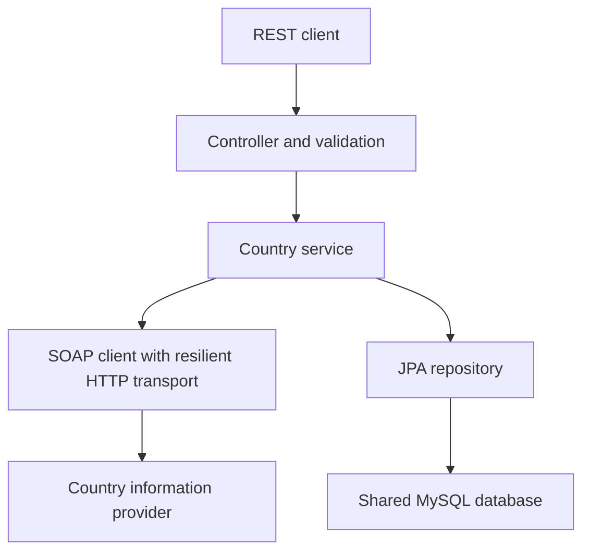

# Country Integration Service

Spring Boot REST service that retrieves country details from an external SOAP API and persists countries and their languages in MySQL. Built for the NCBA LOOP Integrations and Microservices Engineer case study.

## Architecture



Creation normalizes the country name to sentence case (with punctuation-aware title case and a cached canonical provider-name catalogue for unknown names), resolves its ISO code with CountryISOCode, retrieves FullCountryInfo, checks for duplicates, and saves the country and languages. Stored-country reads, updates, and deletes use MySQL. External SOAP calls happen before the database save.

The application replicas share one database. Request state stays within each request. Retry and circuit breaker state is local to each application process.

## Technology

- Java 25, Spring Boot 4.1.1, and Maven wrapper.
- Spring Web, Bean Validation, Spring Data JPA, and MySQL 8.4.
- Java HttpClient and namespace-aware XML parsing for SOAP.
- Resilience4j retry and circuit breaker.
- Spring Boot Actuator, Micrometer, and structured ECS JSON logs.
- JUnit, Mockito, standalone MockMvc, and a local HTTP server for tests.
- Docker Compose and Kubernetes manifests.

## Quick start

Prerequisites: Java 25 and Docker Desktop. Run commands from the project root.

Copy the environment template:

```bash
cp .env.example .env
```

Edit `.env` and replace both password placeholders, then run:

```bash
./mvnw clean verify
docker compose up -d --build
```

The default tests use an isolated H2 database and local SOAP test servers; no live MySQL, SOAP provider, or credentials are needed. The Dockerfile compiles the application in a Java 25 build stage and copies only the executable JAR into the non-root runtime image. A fresh clone can run `docker compose up -d --build` without a prebuilt `target/` directory or a host Java installation. Maven verification is a separate quality check; the image build skips tests.

Check startup and test:

```bash
docker compose ps
docker compose logs --tail=40 app
curl -i http://localhost:8081/actuator/health
curl -i http://localhost:8081/api/countries
```

Allow Spring Boot to finish starting before sending requests. The application is exposed on localhost:8081. The development database is exposed on localhost:3307. Database files persist in the Compose mysql_data volume.

For an existing Compose database created before Flyway, take a backup first and run `DB_BASELINE_ON_MIGRATE=true docker compose up -d --build` once. Confirm the schema validates, then redeploy with the default false. Fresh databases need no baseline flag. Baseline adopts version 1; it does not repair an incompatible schema.

## REST API

| Method | Path | Expected success |
| --- | --- | --- |
| POST | /api/countries | 201 Created, response body and Location header |
| GET | /api/countries?page=0&size=100 | 200 OK, country page as a JSON array |
| GET | /api/countries/{id} | 200 OK, country details |
| PUT | /api/countries/{id} | 200 OK, updated country |
| DELETE | /api/countries/{id} | 204 No Content |

Create a country:

```bash
curl -i --max-time 45 -X POST http://localhost:8081/api/countries \
  -H 'Content-Type: application/json' \
  -d '{"name":"kenya"}'
```

The first successful save returns country details, its generated ID, and languages. A repeated country ISO code returns 409. Use the returned ID for subsequent operations.

Example update body for PUT /api/countries/{id}:

```json
{
  "name": "Kenya",
  "capitalCity": "Nairobi",
  "phoneCode": "254",
  "continentCode": "AF",
  "currencyIsoCode": "KES",
  "countryFlag": "http://www.oorsprong.org/WebSamples.CountryInfo/Flags/Kenya.jpg",
  "languages": [
    {"isoCode": "swa", "name": "Swahili"},
    {"isoCode": "eng", "name": "English"}
  ]
}
```

Update replaces the language collection while preserving the country ID and ISO code. Country data returned by the provider is stored as received, with structural validation.

## Error handling and resilience

Errors use ProblemDetail responses with status, title, detail, instance, timestamp, and path. Validation failures include field errors.

| Status | Typical cause |
| --- | --- |
| 400 | Invalid fields, malformed JSON, or invalid parameter |
| 404 | Country or stored ID not found |
| 405 | HTTP method unsupported for the URL |
| 406 | Requested response format is unsupported |
| 409 | Country ISO code already exists |
| 415 | Request content type is unsupported |
| 502 | Invalid SOAP result or unsuccessful upstream HTTP response |
| 503 | Transport connection failure or open circuit |
| 504 | Upstream timeout |

The transport uses a five-second connection timeout and an eight-second request timeout. Eligible failures receive at most two attempts with a 300-millisecond retry delay. Each HTTP request is capped by the remaining 20-second SOAP sequence budget; this does not cap database work or servlet scheduling.

The circuit breaker evaluates logical calls after retry. It has a ten-call window, minimum five calls, 50% failure threshold, 30-second open duration, and two permitted half-open calls. It ignores non-retryable transport failures. SOAP faults and parsing errors occur outside the transport breaker.

During a SOAP outage, creation returns an explicit error and stored-country reads remain available through MySQL. This is the implemented degraded-operation behavior. The canonical-name catalogue is cached for six hours; country details and fabricated fallback data are not cached.

XML parsing disables DOCTYPE declarations and external DTD/schema access. XML-special characters are escaped in requests.

## Observability

- X-Request-ID identifies each HTTP request and is included in request logging context.
- Structured request logs include method, path, response status, and elapsed milliseconds.
- SOAP logs record retries, transport errors, and circuit transitions.
- Actuator exposes health, metrics, and Prometheus-format metrics.

```bash
curl -i http://localhost:8081/actuator/health
curl -i http://localhost:8081/actuator/metrics/http.server.requests
curl -i http://localhost:8081/actuator/prometheus
```

HTTP metrics and health were verified. Prometheus scraping of both pods, evaluated alert rules and the provisioned Grafana dashboard were verified. Distributed tracing and external notification delivery remain future deployment work. Restrict management endpoint access in a production deployment.

## Tests

```bash
# Default suite: no Docker, MySQL service, SOAP service, or credentials needed.
./mvnw clean verify

# Also run isolated MySQL 8.4 persistence and concurrent duplicate checks.
# Requires a running Docker engine; creates a temporary database container.
./mvnw -Pmysql-it clean verify
```

The verified suite passes 55 default tests plus 9 MySQL integration tests, with no failures, errors, or skips. Coverage includes normalization (including multi-word names), duplicate races, update/delete behavior, SOAP parsing and faults, XML hardening, framework HTTP status preservation, retries, circuit opening, and JPA cascade/orphan behavior. The MySQL tests use their own temporary database and never use the Compose or Kubernetes country data. H2 checks complement the real MySQL checks; they do not prove MySQL compatibility by themselves.

See [test evidence](docs/TEST_RESULTS.md). The [CI workflow](.github/workflows/ci.yaml) runs both suites and builds the image, then uploads test reports. A local pass does not imply a hosted CI run has passed. Load capacity and production availability require separate tests.

## SoapUI

The assessment WSDL was imported with the installed SoapUI 5.10.0. The [saved project](docs/soapui/country-info-soapui-project.xml) contains both SOAP bindings and all 21 operations per binding, plus executable request assertions. See [import screenshot, examples, and verification instructions](docs/soapui/README.md).

```bash
# On macOS this defaults to the installed SoapUI 5.10.0 path.
# Else set SOAPUI_HOME to the installation directory containing bin/testrunner.sh.
./scripts/test-soapui.sh
```

These live provider checks need outbound HTTP access. The supplied brief specifies HTTP; HTTPS did not establish a connection from this environment, so the working assessment endpoint remains configurable through COUNTRY_SOAP_URL.

GET uses zero-based pages, defaults to 100 records and accepts sizes 1–100. Invalid bounds return 400. Fetch successive pages until an empty array to retrieve the complete collection. Country rows are paged in SQL before fetching their languages; the response remains a JSON array.

## Kubernetes

See [deployment and troubleshooting instructions](docs/DEPLOYMENT.md) for complete setup and commands.

```bash
./scripts/deploy.sh
# Keep the port-forward command printed by the script running, then:
./scripts/verify.sh
```

The script builds from source, creates the namespace and Secret from `.env`, waits for MySQL, runs Flyway with one application replica, then scales to two. Fresh schemas migrate automatically; Hibernate validates them. To adopt an existing pre-Flyway schema, first run `./scripts/backup-db.sh`, then explicitly run `BASELINE_EXISTING_SCHEMA=true ./scripts/deploy.sh` once and return to the default false after verification.

`KUBE_CONTEXT`, `APP_REPLICAS` and `APP_IMAGE` override defaults. Image tags are derived from Docker build inputs. `IMAGE_LOAD_MODE=auto` uses Docker Desktop images directly, imports into kind/minikube, or requires `APP_IMAGE=<registry>/<name>:<tag> PUSH_IMAGE=true` for a remote cluster. Remote credentials, storage classes and capacity remain environment prerequisites.

An optional HPA (2–4 replicas, 70% CPU) and disruption budget are in [k8s/optional/autoscaling.yaml](k8s/optional/autoscaling.yaml). They require the metrics API and enough node capacity; automatic scaling has not been load-tested.

- k8s/mysql.yaml defines a single MySQL Deployment, internal Service, and 2 GiB persistent storage claim.
- k8s/app.yaml defines the application ConfigMap, Deployment, and internal Service.
- Credentials come from a Kubernetes Secret created from the local environment file.
- Application startup, readiness, and liveness probes use Actuator endpoints.
- The verified configuration runs two non-root application replicas with resource requests and limits.

Local API access:

```bash
kubectl --context=docker-desktop -n country-integration \
  port-forward service/country-app 8082:8080
```

The Kubernetes database has separate storage from Compose. The local deployment passed health checks, country creation, duplicate handling, and shared-data checks across two application replicas. Tanzania created through one replica was readable through the other.

A later recheck exposed CPU throttling and probe timeouts. The local manifest now requests 500m CPU, allows two CPUs, gives startup ten minutes, and uses ten-second probe timeouts with six liveness failures before restart. Rolling updates replace one replica at a time without surge. After this change, both replicas started in about 64 and 49 seconds and passed a five-minute observation with 88 successful health/data requests, two ready Service backends, and zero restarts. Both returned Kenya and Tanzania. This verifies the local fix over that window; long-term availability and load capacity require separate tests. See the deployment guide for details.

The final verification evidence is in [Kubernetes results](docs/evidence/kubernetes-verification.json) and [64-test results](docs/TEST_RESULTS.md). Earlier probe tuning and the 88-request observation above are historical checks. The latest checks additionally cover hyphenated/canonical country lookup, migration adoption, bounded pages and service metrics. Compose containers are stopped during Kubernetes verification to avoid competing workloads; their database volume is preserved.

## Monitoring and measurements

```bash
kubectl --context=docker-desktop apply -f k8s/optional/monitoring.yaml
kubectl --context=docker-desktop -n country-integration port-forward service/country-prometheus 9090:9090
# Separate terminal:
kubectl --context=docker-desktop -n country-integration port-forward service/country-grafana 3000:3000
```

Prometheus discovers both application pods, scrapes Actuator, and evaluates unavailable/5xx alert rules. Grafana provisions [the service dashboard](docs/monitoring/country-service-dashboard.json). This optional local configuration uses ephemeral storage and internal Services; Grafana permits anonymous viewing. Notification delivery, persistent monitoring storage and production access controls require deployment configuration.

Run `python3 scripts/load-test.py --output target/load-results.json` for a bounded, read-only sample. It records statuses, latency percentiles, request rate and pod identity. A Service port-forward uses one pod for its session; use `./scripts/load-test-k8s.sh` to measure the internal Service route across both replicas. See [measured local results](docs/evidence/load-results.json). Local measurements do not establish maximum throughput or production capacity.

## Current limits and next improvements

Versioned Flyway migrations, Hibernate validation, and an explicit existing-schema baseline are implemented and tested against MySQL. The backup script creates a private compressed dump. The [isolated restore script](scripts/test-backup-restore.py) recovered all six countries, six languages and migration history in disposable MySQL; see [restore evidence](docs/evidence/backup-restore-verification.json). This local check does not establish production disaster recovery. The SOAP sequence has a 20-second budget across lookups/retries; database work and servlet scheduling are outside that budget.

Both replicas run on one Docker Desktop node and MySQL has one instance. The metrics API is absent here, so HPA behavior remains unverified. Production still requires multi-node/database HA, recovery exercises, API authentication/TLS, managed secrets, monitoring notification destinations and sustained load/failure tests. The assessment provider remains HTTP as supplied in the brief; its endpoint is configurable. These boundaries are stated in the presentation.

## Case study submission

Prepared by Samuel Mutua Kimani.

- [Presentation, 18 slides](docs/submission/Case%20Study%20Submission%20%E2%80%93%20Integrations%20and%20Microservices%20Engineer%20%E2%80%93%20Samuel%20Mutua%20Kimani.pptx)
- [Matching PDF, 18 pages](docs/submission/Case%20Study%20Submission%20%E2%80%93%20Integrations%20and%20Microservices%20Engineer%20%E2%80%93%20Samuel%20Mutua%20Kimani.pdf)
- [GitHub repository](https://github.com/kimtour/country-integration-service)

The presentation follows questions 1–10, explains entity/DTO responsibilities, provides exact setup/test commands, and distinguishes verified local results from proposed production architecture. See [submission instructions and email draft](docs/submission/README.md).

See [assessment requirement coverage and trade-offs](docs/REQUIREMENTS.md).
